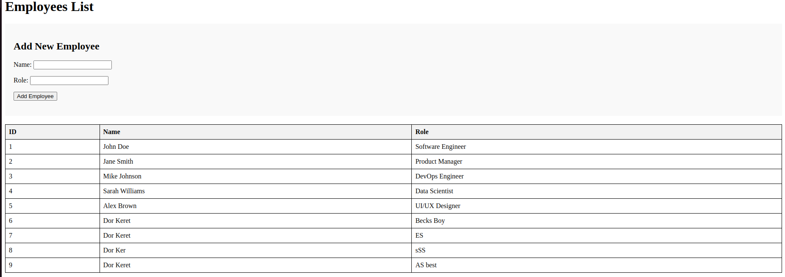
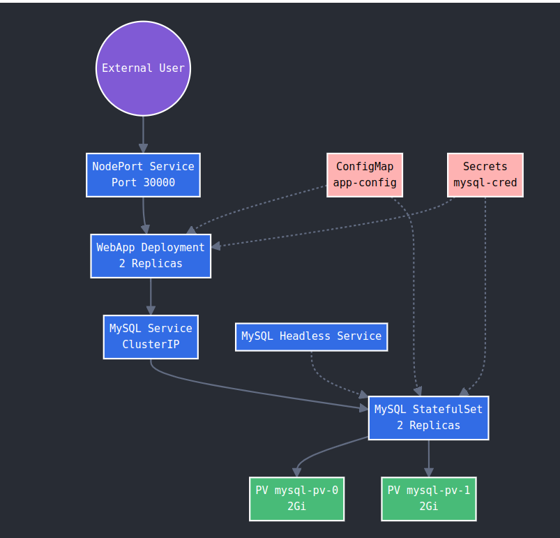
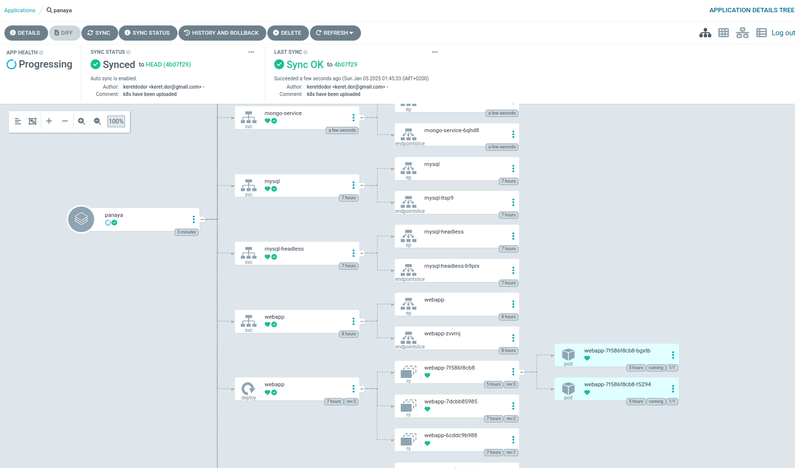

# Employee Management System

## Overview
This project implements a containerized employee management system using a Flask web application with MySQL database backend. The application is designed to be deployed either using Docker Compose for local development or Kubernetes for production environments.

## Application Architecture

### Web Application (Flask)
The web application provides a simple interface for managing employee records with the following features:
- Display all employees in a tabular format
- Add new employees with their names and roles
- Automatic timestamp tracking for record creation and updates
- Health check endpoint for monitoring
- Database connection retry mechanism for improved reliability

### Database (MySQL)
The MySQL database stores employee information with the following schema:
- `id`: Auto-incrementing primary key
- `name`: Employee name (VARCHAR)
- `role`: Employee role/position (VARCHAR)
- `created_at`: Timestamp of record creation
- `updated_at`: Timestamp of last record update



## Directory Structure
```
.
├── application/
│   ├── webapp/
│   │   ├── app.py              # Flask application
│   │   ├── requirements.txt    # Python dependencies
│   │   ├── Dockerfile         # Web app container configuration
│   │   └── templates/
│   │       └── index.html     # Web interface template
│   └── mysql/
│       ├── Dockerfile        # MySQL container configuration
│       └── init.sql         # Database initialization script
├── kubernetes/
│   ├── configmap.yml        # Application configuration
│   ├── secret.yml          # Sensitive credentials
│   ├── flask.yml          # Web application deployment
│   ├── mysql.yml         # Database StatefulSet
│   └── pv-mysql.yml     # Persistent volume configuration
└── docker-compose.yml    # Local development setup
```

## Development Setup (Docker Compose)
### Environment Variables
The application uses the following environment variables:
```
MYSQL_HOST=mysql
MYSQL_USER=user
MYSQL_PASSWORD=password
MYSQL_DATABASE=employees_db
MYSQL_ROOT_PASSWORD=password
```

### Running Locally
1. Clone the repository
2. Navigate to the project directory
3. Run: `docker-compose up --build`
4. Access the application at: `http://localhost:5000`

## Production Deployment (Kubernetes)
### Kubernetes Components



1. **ConfigMap** (`configmap.yml`)
   - Stores non-sensitive configuration
   - Database connection details
   - User configuration

2. **Secrets** (`secret.yml`)
   - Stores sensitive credentials
   - MySQL passwords (base64 encoded)

3. **Web Application** (`flask.yml`)
   - Deployment with 2 replicas
   - Resource limits and requests
   - Liveness probe configuration
   - NodePort service exposure

4. **Database** (`mysql.yml`)
   - StatefulSet with 2 replicas
   - Persistent storage configuration
   - Headless service for replica discovery
   - ClusterIP service for application access

5. **Storage** (`pv-mysql.yml`)
   - PersistentVolumes for database storage
   - Manual storage class
   - Host path configuration

### Deployment Steps
1. Create the storage resources:
   ```bash
   kubectl apply -f kubernetes/pv-mysql.yml
   ```

2. Create the ConfigMap and Secrets:
   ```bash
   kubectl apply -f kubernetes/configmap.yml
   kubectl apply -f kubernetes/secret.yml
   ```

3. Deploy the database:
   ```bash
   kubectl apply -f kubernetes/mysql.yml
   ```

4. Deploy the web application:
   ```bash
   kubectl apply -f kubernetes/flask.yml
   ```

5. Access the application:
   ```bash
   kubectl get nodes -o wide  # Get node IP
   ```
   Access the application at: `http://<node-ip>:30000`
# Employee Management System

[Previous sections remain unchanged until the new section]

## Continuous Deployment with ArgoCD

### Overview
Our Employee Management System uses ArgoCD to implement GitOps-based continuous deployment. ArgoCD watches our Git repository and automatically synchronizes the Kubernetes cluster state to match our manifests, ensuring our deployment always matches our desired configuration in Git.

### Installation and Access
We installed ArgoCD in our cluster using the official manifests and exposed it through port forwarding:

```bash
# Install ArgoCD
kubectl create namespace argocd
kubectl apply -n argocd -f https://raw.githubusercontent.com/argoproj/argo-cd/stable/manifests/install.yaml

# Access the UI
kubectl port-forward svc/argocd-server -n argocd 8080:443
```

The ArgoCD interface can be accessed at `https://localhost:8080`



## Security Considerations
- Database credentials are stored in Kubernetes secrets
- Database root password is properly configured
- Web application uses connection pooling
- Container images use specific versions
- Resource limits are defined for containers

## Monitoring and Health Checks
- Web application includes a `/healthy` endpoint
- Kubernetes liveness probe configured
- Database connection retry mechanism implemented
- Container health checks configured in docker-compose

## Scaling and High Availability
- Web application can be scaled horizontally
- Database configured as StatefulSet for replication
- Persistent storage ensures data durability
- Services configured for proper load distribution

## Future Improvements
1. Implement HTTPS support
2. Add database backup solution
3. Implement user authentication
4. Add Prometheus metrics
5. Configure horizontal pod autoscaling


